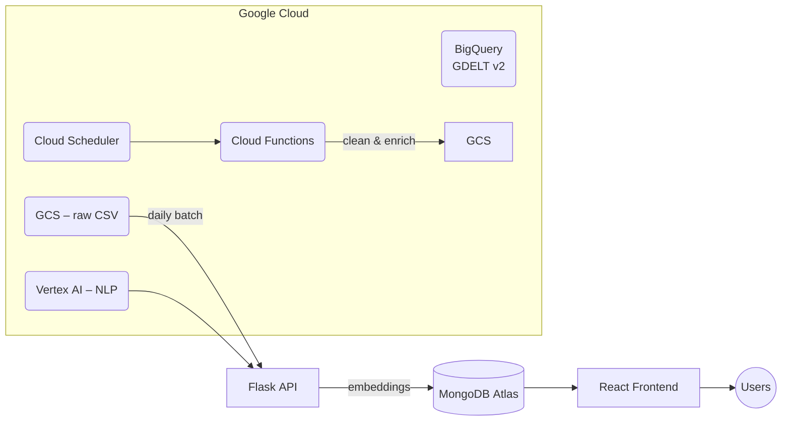

# GlobaLens: See Beyond the Headlines

GlobaLens is an AI‑powered platform that turns the fire‑hose of global news into an interactive, searchable world map. We combine real‑time data ingestion (GDELT), geospatial visualization, and semantic vector search so that journalists, analysts, and decision‑makers can explore unfolding stories quickly—and in context.

---

## ✨ Key Features

| Feature | Description |
| ------- | ----------- |
|         |             |

| **Live Event Mapping**       | Streams GDELT events and plots them on an interactive globe (react‑globe.gl).                                            |
| ---------------------------- | ------------------------------------------------------------------------------------------------------------------------ |
| **Filters & Timelines**      | Narrow results by date or event type to focus on a specific window.                                                      |
| **Semantic Chat Search**     | Query with natural language (e.g. "recent drought impacts") and retrieve related events via MongoDB Atlas Vector Search. |
| **Instant Summaries**        | Click any point on the map to see an AI‑generated TL;DR of the article, publication date, and source URL.                |
| **Similar Events Discovery** | Each summary includes a *“Find similar”* button that clusters semantically close events.                                 |

---

## 🏗️  Architecture Overview



- **Data Ingestion** – Cloud Scheduler triggers Cloud Functions that query GDELT (via BigQuery), write raw CSVs to GCS, and call Vertex AI to generate summaries/sentiment.
- **Storage** – Cleaned docs and embeddings are stored in MongoDB Atlas (flexible JSON schema + Vector Search index).
- **API** – Flask exposes REST endpoints for events, summaries, and vector similarity.
- **Frontend** – Vite + React renders the globe, chat search, and filters in real‑time with Tailwind styling.

---

## 🛠️  Tech Stack

- **Frontend** : React 18, Vite, Tailwind CSS, react‑globe.gl, Zustand
- **Backend** : Python 3.11, Flask, Pydantic, Sentence‑Transformers
- **Database** : MongoDB Atlas (Vector Search, Atlas Triggers)
- **Cloud** : Google Cloud Platform (BigQuery, Cloud Functions, Cloud Scheduler, Cloud Storage, Vertex AI)
- **DevOps** : Docker Compose, GitHub Actions

---

## 🚀 Quick Start (Local Dev)

### 1. Prerequisites

- Docker Desktop **or**
  - Node >= 20 (frontend)
  - Python >= 3.10 (backend)
- MongoDB Atlas cluster (free tier works fine)
- A Google Cloud project with BigQuery & Vertex AI enabled

### 2. Clone & Configure

```bash
# clone repo
$ git clone https://github.com/<your‑org>/globalens.git
$ cd globalens

# copy sample envs
$ cp .env.example .env          # root (frontend)
$ cp backend/.env.example backend/.env  # backend
```

Edit the two `.env` files with your credentials:

```dotenv
# backend/.env
MONGODB_URI="mongodb+srv://<user>:<pass>@cluster0.mongodb.net"
GCP_PROJECT_ID="your‑project"
GOOGLE_APPLICATION_CREDENTIALS="/path/to/key.json"
VERTEX_MODEL="text-bison-32k"
HF_TOKEN="<optional-huggingface-token>"
```

### 3. Run with Docker (recommended)

```bash
$ docker compose up --build
```

**Services**

- `frontend` → [http://localhost:5173](http://localhost:5173)
- `backend`  → [http://localhost:8000](http://localhost:8000)

### 4. Run Manually (alt)

```bash
# backend
$ cd backend
$ python -m venv venv && source venv/bin/activate
$ pip install -r requirements.txt
$ flask --app app run --reload

# frontend (new terminal)
$ cd frontend
$ npm install
$ npm run dev
```

---

## 📡  Data Pipeline (Production)

1. **Cloud Scheduler** (cron: `0 * * * *`) → triggers `ingest_gdelt` Cloud Function.
2. **Cloud Function**
   - Queries last hour of events from BigQuery `gdeltv2.events`, joins with `translations`.
   - Dumps CSV to `gs://globalens-stage/ingest/yyyymmdd_hh.csv`.
   - Invokes Vertex AI for summary & sentiment.
   - Writes JSON docs + embeddings to MongoDB Atlas.
3. **Atlas Trigger** builds geospatial & vector indexes if missing.

> **Tip:** For low‑cost testing, change the cron to `0 */6 * * *`.

---

## 🖥️  Directory Structure

```
.
├── backend/        # Flask API & data pipeline scripts
│   ├── app.py
│   ├── requirements.txt
│   └── ...
├── frontend/       # React source (Vite + Tailwind)
│   ├── src/
│   │   ├── components/
│   │   ├── pages/
│   │   └── hooks/
│   └── vite.config.js
├── infra/          # Terraform & Cloud Function sources
├── docker-compose.yml
└── README.md
```

---

## 🛣️  Roadmap

- **Event Clustering** – visually group similar events with DBSCAN on embeddings.
- **Alerting Rules** – user‑defined triggers (e.g., "magnitude > 7 earthquake") → email/SMS.
- **Multi‑lingual UI** – automatic translation of summaries.
- **Offline Mode** – PWA support for low‑bandwidth environments.

---

## 🤝  Contributing

Pull requests and ⭐ stars are welcome! To get started:

1. Fork the repo & create a feature branch.
2. Run `pre-commit install` to enable lint/format hooks.
3. Submit a PR describing your change.

---

## 📄 License

Distributed under the **MIT License**. See `LICENSE` for more information.

---

## 🙏  Acknowledgements

- [GDELT Project](https://www.gdeltproject.org/) for open global event data.
- [MongoDB Atlas Vector Search](https://www.mongodb.com/) for powering semantic queries.
- [Google Cloud](https://cloud.google.com/) for BigQuery & Vertex AI credits.
- Icons by [Lucide](https://lucide.dev/) • Map by [react‑globe.gl](https://github.com/vasturiano/react-globe.gl).

---

> Built with ❤️ by the GlobaLens team. See something cool? Let us know!

